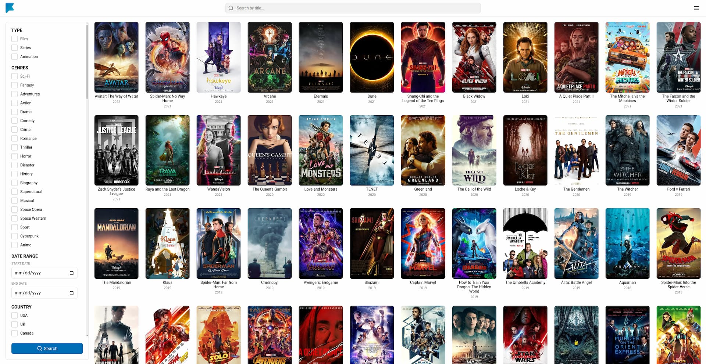

# Films Collection

A personal list of films with manually collected data. The app primarily focuses on representing basic film data and some of the author's subjective perspectives, such as ratings, collections, and comments.

> ❗ DISCLAIMER: All media files, videos, and information are the intellectual property of their respective authors. All data has been sourced from open sources and is used for informational purposes only. The data was gathered manually without the use of scrapers or third-party APIs.

## Tech Stack

### Frontend

- React
- Vite
- TypeScript
- TanStack Router
- TanStack Query
- React Hook Form
- Zod

### Backend

- Fastify
- PostgreSQL
- TypeScript
- Docker
- Prisma
- Zod

## Development server

### Prerequisites

1. Node 20+
2. Docker
3. Cloudinary account

### Start dev server

1. In the project root, run `pnpm install` to install dependencies for both the frontend and backend.
2. Create `.env` files in the `apps/api` and `apps/web` directories following examples from the `./apps/api/.env.sample` and `./apps/web/.env.sample` respectively.
3. Run `pnpm db:start` to spin up a database.
4. Run `pnpm db:init` in the root. It will run migrations.
5. In the project's root run `pnpm dev` to start the application.

## Build project

### Local mode

1. Run `pnpm build` in the project's root. The script builds the backend to the `./apps/api/dist` directory and frontend to the `./apps/api/dist/public`

2. Run `node apps/api/dist/server.js` to start the application

3. Open the app `http://localhost:5000`

### Container mode

1. Fill the `.env` file in the `apps/api` folder based on the `.env.sample`

1. Run `pnpm build:container`. It will build the app and spin up the database.

2. Open the app `http://localhost:5000`
