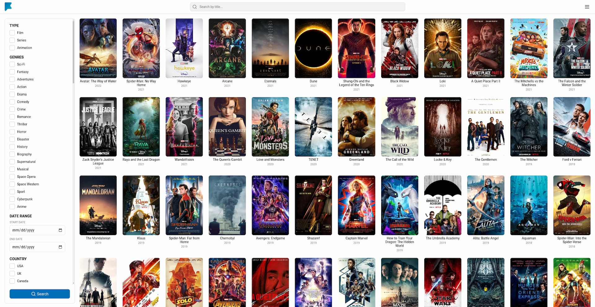

# Films Collection

A personal list of films with manually collected data. The app mainly focuses on representing the base film data and some of the author's subjective visions, such as ratings, collections and comments.

## Tech Stack

### Frontend

- React
- Vite
- TypeScript
- *TanStack Router*
- *TanStack Query*
- *React Hook Form*
- *Lucide Icons*

### Backend

- Fastify
- PostgreSQL
- TypeScript
- Docker
- *Prisma*
- *SWC*
- *tsx*

## Start development server

1. Go to the server folder and create `.env` file. Copy all required variables from the `env.sample.txt`.
2. Repeat step 1 for the `client` folder.
3. In the root of the project run `npm run install:all` command. It will install dependencies in the client and server folders.
4. In the root run `npm run dev`. It will start both client and server via `concurrently`.
5. Open `http://localhost:3030`

## Build project

1. Run `npm run build` in the root of the project. The command builds the code into `client/dist` and `server/dist`.

The backend is ready to deploy to fly.io, see [docs](https://fly.io/docs/launch/deploy/)

## Dataset

Dataset folder contains data to populate relational database. The project uses prisma to seed data, but data is versatile and can be used with any ORM and any SQL database.

Dataset has three main parts:

1. **Films** - JSON files with base information about movies. 

The data includes:
- ID;
- title;
- type (Film, Series);
- style (Live Action, Animation);
- release date;
- duration - movie running time in minutes;
- poster - path to a file in a storage that supports direct static URLs. If the `VITE_BASE_MEDIA_URL` variable is not set in the `.env` file in the `client` folder, the app will omit posters and will show placeholder;
- youtube trailer ID (slug);
- budget;
- box office;
- description - short description of the plot (NULL for the series type);
- chapter key - unique identifier of movie series;
- chapter order - order in a series;
- rating - 3 levels of movies evaluation: 3 - highest rated movies, 2 - awesome movies, 1 - great movies with some nuances.

2. **General** - collection of base data (id, title, description, image etc.):
- genres;
- countries;
- studios;
- collections;
- people - actors, directors, writers etc.;
- awards;
- nominations.

3. **Relations** - describes relations between movies and base data, e.g. genres of films.

SQL schema can be taken in the `server/prisma/migrations` folder. The schema fits PostgreSQL.